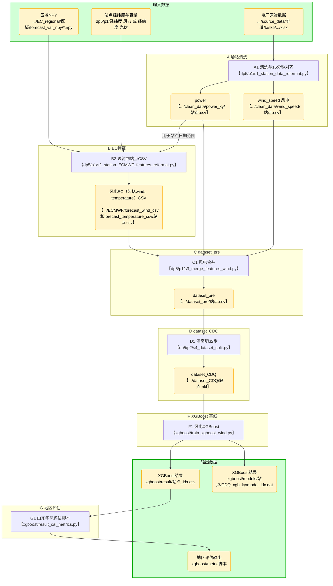

# 山东华风-风站-XGBoost算法——项目说明与脚本使用

## 脚本使用

### data\_pipeline

#### Step1：处理场站wind\&power数据

1. 对应脚本：`src/data_pipeline/s1_station_data_reformat.py`
2. 脚本功能
   - 读取两个风电场站原始CSV，统一整理字段 `date_time / power / wind_speed`
   - 清洗规则：仅保留秒=0的整分数据；同一时刻多条记录保留第一条；`power` 裁剪到 >=0 且从 kW 转为 MW（除以 1000）；`wind_speed > 30` 置为 NaN
   - 15min重采样：构造整15分钟时间轴（00/15/30/45，秒=0），使用 `time` 插值补齐，最终仅输出 15min 网格点
   - 输出：`power_ky/站点.csv` 与 `wind_speed/站点.csv`
3. 执行脚本命令（远端执行最简执行+最全命令参数说明）
   - 最简执行（远端 n93，env1）：`python src/data_pipeline/s1_station_data_reformat.py`
   - 参数说明：当前脚本无命令行参数，输入/输出路径在脚本内固定
4. 读取数据（路径、说明）
   - `/mnt/md0/Power_Forecast_Data/source_data/华风/日照五莲/日照五莲风电场.csv`
   - `/mnt/md0/Power_Forecast_Data/source_data/华风/威海新区/威海新区风电场.csv`
   - 字段映射：`timestamp -> date_time`，`可用功率 -> power`，`平均风速 -> wind_speed`
5. 写入数据（路径、说明）
   - 输出根目录：`/mnt/md0/zhouyunqi/HuaFeng/data/s1_clean_data`
   - 功率（MW）：`/mnt/md0/zhouyunqi/HuaFeng/data/s1_clean_data/power_ky/站点.csv`（列：`date_time,power`）
   - 风速：`/mnt/md0/zhouyunqi/HuaFeng/data/s1_clean_data/wind_speed/站点.csv`（列：`date_time,wind_speed`）

#### Step2:修改风站ECMWF数据处理逻辑

1. 对应脚本：`src/data_pipeline/s2_station_ECMWF_features_reformat.py`
2. 脚本功能
   - 将区域 ECMWF 格点预报（npy）按场站经纬度提取为站点级预报特征（csv）
   - 特征构造：
     - 基础特征：对站点所在 2x2 格点做双线性插值，得到站点整点序列
     - 周围格点特征：以插值网格为中心取 4x4 周围格点的原始值（命名：`{feat}_{i}_{j}`）
     - 时间分辨率：将整点/逐小时序列线性插值到 15min 序列，单次起报输出 408 行（0\~102h，每 15min 一行）
   - 输出拆分：风特征与温度特征分别输出到两个子目录
3. 执行脚本命令（远端执行最简执行+最全命令参数说明）
   - 最简执行（远端 n93，env1）：
     - 全站点（stations.csv 中所有站点）：`python src/data_pipeline/s2_station_ECMWF_features_reformat.py`
     - 单站点示例：`python src/data_pipeline/s2_station_ECMWF_features_reformat.py --station 日照五莲`
   - 参数说明：
     - `--region`：ECMWF 区域目录名，默认 `华东华中区域`
     - `--station`：站点名，默认 `all`（处理 stations.csv 中所有站点）
     - `--n-workers`：并行进程数，默认 `16`
     - `--input-region-root`：ECMWF 区域数据根目录，默认 `/mnt/md0/Power_Forecast_Data/EC_regional`
     - `--stations-file`：站点信息表，默认 `/mnt/md0/zhouyunqi/HuaFeng/data/stations.csv`
     - `--power-dir`：功率数据目录（用于确定每个站点可用日期范围），默认 `/mnt/md0/zhouyunqi/HuaFeng/data/s1_clean_data/power_ky`
     - `--output-wind-dir`：风预报特征输出目录，默认 `/mnt/md0/zhouyunqi/HuaFeng/data/s2_forecast_csv/wind`
     - `--output-temperature-dir`：温度预报特征输出目录，默认 `/mnt/md0/zhouyunqi/HuaFeng/data/s2_forecast_csv/temperature`
4. 读取数据（路径、说明）
   - 站点表：`/mnt/md0/zhouyunqi/HuaFeng/data/stations.csv`（列：`station_id,longitude,latitude,capacity_mw`）
   - 功率数据（用于截取有效日期范围）：`/mnt/md0/zhouyunqi/HuaFeng/data/s1_clean_data/power_ky/站点.csv`
   - ECMWF 区域 npy（按年/月/文件分层）：
     - 风：`/mnt/md0/Power_Forecast_Data/EC_regional/华东华中区域/forecast_wind_npy_0.1`
     - 温度：`/mnt/md0/Power_Forecast_Data/EC_regional/华东华中区域/forecast_temperature_npy_0.1`
5. 写入数据（路径、说明）
   - 输出根目录：`/mnt/md0/zhouyunqi/HuaFeng/data/s2_forecast_csv`
   - 风预报特征：`/mnt/md0/zhouyunqi/HuaFeng/data/s2_forecast_csv/wind/站点.csv`（列：`forecast_date,date_time,<wind_features...>`）
   - 温度预报特征：`/mnt/md0/zhouyunqi/HuaFeng/data/s2_forecast_csv/temperature/站点.csv`（列：`forecast_date,date_time,<temperature_features...>`）

#### Step3：合并 power + wind\_speed + ECMWF 风/温特征（站点级数据集）

1. 对应脚本：`src/data_pipeline/s3_merge_power_and_ECMWF_features_wind.py`
2. 脚本功能
   - 读取站点功率（Step1 输出）、站点实测风速（Step1 输出）、站点级 ECMWF 风预报特征（Step2 输出）、站点级 ECMWF 温度预报特征（Step2 输出）
   - ECMWF 裁剪逻辑（保持与历史版本一致）：
     - 每个起报对应 408 行（0\~102h，15min 一行），按 block\_size=408 切块
     - 每个 block 仅保留固定的 96 行：`[16+96 : 16+96+96]`
     - 风/温特征横向拼接后作为特征表 `df_feature`
   - 合并逻辑：以 ECMWF 特征表为主（LEFT JOIN），按 `date_time` 将 `power` 与 `wind_speed` 合并到特征表中（合并后允许出现 NaN）
   - 输出：每个站点一个 csv（文件名：`站点.csv`）
3. 执行脚本命令（远端执行最简执行+最全命令参数说明）
   - 最简执行（远端 n93，env1）：
     - 全站点（stations.csv 中所有站点）：`python src/data_pipeline/s3_merge_power_and_ECMWF_features_wind.py`
     - 单站点示例：`python src/data_pipeline/s3_merge_power_and_ECMWF_features_wind.py --station 威海新区`
   - 参数说明：
     - `--station`：站点名，默认 `all`（处理 stations.csv 中所有站点）
     - `--n-workers`：并行进程数，默认 `16`
     - `--stations-file`：站点信息表，默认 `/mnt/md0/zhouyunqi/HuaFeng/data/stations.csv`
     - `--power-dir`：功率数据目录，默认 `/mnt/md0/zhouyunqi/HuaFeng/data/s1_clean_data/power_ky`
     - `--wind-dir`：实测风速数据目录，默认 `/mnt/md0/zhouyunqi/HuaFeng/data/s1_clean_data/wind_speed`
     - `--ec-wind-dir`：风预报特征目录，默认 `/mnt/md0/zhouyunqi/HuaFeng/data/s2_forecast_csv/wind`
     - `--ec-temperature-dir`：温度预报特征目录，默认 `/mnt/md0/zhouyunqi/HuaFeng/data/s2_forecast_csv/temperature`
     - `--output-dir`：输出目录，默认 `/mnt/md0/zhouyunqi/HuaFeng/data/s3_dataset_pre`
4. 读取数据（路径、说明）
   - 站点表：`/mnt/md0/zhouyunqi/HuaFeng/data/stations.csv`（列：`station_id,longitude,latitude,capacity_mw`）
   - 功率数据（Step1 输出）：`/mnt/md0/zhouyunqi/HuaFeng/data/s1_clean_data/power_ky/站点.csv`（列：`date_time,power`）
   - 实测风速数据（Step1 输出）：`/mnt/md0/zhouyunqi/HuaFeng/data/s1_clean_data/wind_speed/站点.csv`（列：`date_time,wind_speed`）
   - 风预报特征（Step2 输出）：`/mnt/md0/zhouyunqi/HuaFeng/data/s2_forecast_csv/wind/站点.csv`
   - 温度预报特征（Step2 输出）：`/mnt/md0/zhouyunqi/HuaFeng/data/s2_forecast_csv/temperature/站点.csv`
5. 写入数据（路径、说明）
   - 输出根目录：`/mnt/md0/zhouyunqi/HuaFeng/data/s3_dataset_pre`
   - 输出文件：`/mnt/md0/zhouyunqi/HuaFeng/data/s3_dataset_pre/站点.csv`
   - 输出列说明（概览）：
     - `forecast_date,date_time` 以及 ECMWF 风特征列
     - ECMWF 温度特征列（合并时会去掉温度文件中的 `forecast_date,date_time` 重复字段）
     - `power`（功率，MW）与 `wind_speed`（实测风速）

#### Step4：滑窗构造 CDQ 样本并保存为 PKL

1. 对应脚本：`src/data_pipeline/s4_dataset_split.py`
2. 脚本功能
   - 读取 Step3 输出的站点级时序 CSV（每站一个文件）
   - 按滑窗构造监督学习样本：
     - 历史窗口长度 `seq_len`（默认 16）
     - 预测窗口长度 `pred_len`（默认 16）
     - 历史与预测之间可插入间隔 `gap_len`（默认 1；以 15min 为单位，gap\_len=1 表示间隔 30min）
     - 每个滑窗的原始长度为 `seq_len + gap_len + pred_len`，构造样本时会丢弃 gap 部分，使最终样本长度固定为 `seq_len + pred_len`
   - mask 处理逻辑：
     - 若原数据已有 `mask` 列，则会将 `power` 为 NaN 的位置额外 mask 掉（`mask = notna(power) * mask`）
     - 若原数据无 `mask` 列，则以 `power` 非空作为 `mask`
   - 输出：每个站点一个 `.pkl`（内部为拼接后的 DataFrame；每个样本块对应连续 `seq_len + pred_len` 行）
   - 说明：脚本默认不做训练/测试集拆分；如需按月份输出 train/test，可开启 `--save-split`
3. 执行脚本命令（远端执行最简执行+最全命令参数说明）
   - 最简执行（远端 n93，env1）：`python src/data_pipeline/s4_dataset_split.py`
   - 参数说明：
     - `--input-dir`：输入目录（Step3 输出目录），默认 `/mnt/md0/zhouyunqi/HuaFeng/data/s3_dataset_pre`
     - `--output-dir`：输出目录，默认 `/mnt/md0/zhouyunqi/HuaFeng/data/s4_dataset_CDQ`
     - `--seq-len`：历史窗口长度，默认 `16`
     - `--gap-len`：间隔步数（15min/步），默认 `1`
     - `--pred-len`：预测窗口长度，默认 `16`
     - `--save-split`：是否额外导出 train/test 两份数据（按 `date_time` 的月份划分），默认关闭
     - `--test-months`：测试集月份列表（仅在 `--save-split` 时生效），默认 `2026-04 2026-05`
   - 示例：按 2026 年 4/5 月作为测试集额外导出 train/test：`python src/data_pipeline/s4_dataset_split.py --save-split --test-months 2026-04 2026-05`
4. 读取数据（路径、说明）
   - 输入根目录：`/mnt/md0/zhouyunqi/HuaFeng/data/s3_dataset_pre`
   - 输入文件：`/mnt/md0/zhouyunqi/HuaFeng/data/s3_dataset_pre/站点.csv`
   - 必要列：
     - `power`（用于生成/修正 `mask`）
     - 若开启 `--save-split`：需要 `date_time` 列用于按月份划分
5. 写入数据（路径、说明）
   - 输出根目录：`/mnt/md0/zhouyunqi/HuaFeng/data/s4_dataset_CDQ`
   - 输出文件：`/mnt/md0/zhouyunqi/HuaFeng/data/s4_dataset_CDQ/站点.pkl`
   - 可选输出（仅 `--save-split`）：`/mnt/md0/zhouyunqi/HuaFeng/data/s4_dataset_CDQ/split/站点_train.pkl` 与 `.../站点_test.pkl`

### models\_XGBoost

#### Step5：训练风电 XGBoost 并输出预测结果（按站点/步长）

1. 对应脚本：`src/models/xgboost/train_xgboost_wind.py`
2. 脚本功能
   - 读取 Step4 输出的 CDQ 数据集（每站一个 `pkl`），并从 `stations.csv` 读取站点列表与装机容量（用于 CR 指标归一化）
   - 对每个站点训练 XGBoost 回归模型：
     - `forecast_index` 取值 `0~15`（默认全跑），每个 `forecast_index` 训练一个模型
     - 样本切片逻辑（保持与原实现一致）：
       - `sample_size=32`，每 32 行为一个样本块（0\~31 时刻）
       - 目标点为 `16 + forecast_index` 时刻的 `power`
     - 特征构造（保持与原实现一致）：
       - ECMWF 风相关特征列筛选（按列名后缀/网格索引过滤）
       - 由 U/V 分量构造风速模长 `sqrt(U^2+V^2)` 及其 `**2/**3` 衍生项
   - 数据集划分（脚本内固定）：
     - 测试集月份：`2026-04`、`2026-05`
     - 其余月份作为训练集
   - 输出：
     - `outputs/model`：每站点每步长一个模型文件
     - `outputs/result`：每站点每步长一个预测结果 CSV（含 `date_time,pred,label`）
3. 执行脚本命令（远端执行最简执行+最全命令参数说明）
   - 最简执行（远端 n93，env1）：`python src/models/xgboost/train_xgboost_wind.py`
   - 常用示例：
     - 指定 GPU：`python src/models/xgboost/train_xgboost_wind.py --gpu_id 7`
     - CPU 模式（规避 GPU 显存不足）：`python src/models/xgboost/train_xgboost_wind.py --gpu_id cpu`
     - 单站点：`python src/models/xgboost/train_xgboost_wind.py --station 威海新区`
     - 单站点 + 单步长：`python src/models/xgboost/train_xgboost_wind.py --station 威海新区 --forecast_index 15`
   - 参数说明：
     - `--gpu_id`：GPU 编号（如 `7`），或传 `cpu` 使用 CPU；默认 `7`
     - `--station`：站点名，默认 `all`（处理 `stations.csv` 中所有站点）
     - `--forecast_index`：预测步长索引，默认 `all`（训练 0\~15）；传 `0~15` 可仅训练某一步长
     - `--data_dir`：Step4 输出目录（每站点 `pkl`），默认 `/mnt/md0/zhouyunqi/HuaFeng/data/s4_dataset_CDQ`
     - `--stations_file`：站点信息表，默认 `/mnt/md0/zhouyunqi/HuaFeng/data/stations.csv`
     - `--output_root`：输出根目录，默认 `/mnt/md0/zhouyunqi/HuaFeng/outputs`
4. 读取数据（路径、说明）
   - CDQ 数据集（Step4 输出）：`/mnt/md0/zhouyunqi/HuaFeng/data/s4_dataset_CDQ/站点.pkl`
   - 站点表：`/mnt/md0/zhouyunqi/HuaFeng/data/stations.csv`（列：`station_id,longitude,latitude,capacity_mw`）
     - 容量字段用于评价指标归一化：脚本优先使用 `ymax` 列；若无则使用 `capacity_mw`（或 `capacity/y_max`）
5. 写入数据（路径、说明）
   - 输出根目录：`/mnt/md0/zhouyunqi/HuaFeng/outputs`
   - 模型目录：`/mnt/md0/zhouyunqi/HuaFeng/outputs/model/站点/CDQ_xgb_ky/model_<forecast_index>.dat`
   - 结果目录：`/mnt/md0/zhouyunqi/HuaFeng/outputs/result/xgboost_站点/站点_<forecast_index>.csv`
6. 在 screen（hf）中运行（推荐）
   - 登录并进入 screen：`ssh n93` 后执行 `screen -d -r hf`
   - 在 screen 内执行：
     - `cd /mnt/md0/zhouyunqi/HuaFeng`
     - `conda activate env1`
     - `python src/models/xgboost/train_xgboost_wind.py --gpu_id cpu > /mnt/md0/zhouyunqi/HuaFeng/outputs/train_xgb_wind.log 2>&1`
   - 查看日志：`tail -f /mnt/md0/zhouyunqi/HuaFeng/outputs/train_xgb_wind.log`
   - 脱离 screen（不中断任务）：按 `Ctrl+A` 再按 `D`

## 项目结构

### 目录
### 流程框图
